<h1>User Manual</h1>

<!-- TOC -->

<h2 id="toc">Table Of Contents</h2>

<!-- toc-begin -->
- [Table Of Contents](#toc)
- [Introduction](#introduction)
  - [Features](#introduction-features)
- [Concepts](#concepts)
  - [Project](#concepts-project)
  - [Track](#concepts-track)
  - [Note Track](#concepts-note-track)
  - [Curve Track](#concepts-curve-track)
  - [MIDI/CV Track](#concepts-midi-cv-track)
  - [Pattern](#concepts-pattern)
  - [Snapshot](#concepts-snapshot)
  - [Song](#concepts-song)
  - [Scale](#concepts-scale)
  - [Clock](#concepts-clock)
  - [Routing](#concepts-routing)
  - [Controller](#concepts-controller)
  - [File Management](#concepts-file-management)
- [User Interface](#ui)
  - [Overview](#ui-overview)
  - [Navigation](#ui-navigation)
  - [Page Layout](#ui-page-layout)
  - [List Pages](#ui-list-pages)
  - [Copy/Paste](#ui-copy-paste)
- [Pages](#pages)
  - [Project](#pages-project)
  - [Layout](#pages-layout)
  - [Track](#pages-track)
  - [Sequence](#pages-sequence)
  - [Steps](#pages-steps)
  - [Song](#pages-song)
  - [Tempo](#pages-tempo)
  - [Pattern](#pages-pattern)
  - [Performer](#pages-performer)
  - [Routing](#pages-routing)
  - [Midi Output](#pages-midi-output)
  - [User Scale](#pages-user-scale)
  - [Monitor](#pages-monitor)
  - [Clock](#pages-clock)
  - [System](#pages-system)
- [Appendix](#appendix)
  - [Divisors](#appendix-divisors)
  - [Run Modes](#appendix-run-modes)
  - [Play Modes](#appendix-play-modes)
  - [Rotation](#appendix-rotation)
  - [Scales](#appendix-scales)
  - [Shapes](#appendix-shapes)
  - [Launchpad](#appendix-launchpad)
  - [Calibration Procedure](#appendix-calibration-procedure)
  - [Firmware Update](#appendix-firmware-update)
<!-- toc-end -->

<!-- Introduction -->

<h2 id="introduction">Introduction</h2>

**per\|former** is an open source and open hardware eurorack sequencer module. It packs a lot of functionality into a small form factor and was designed both as a versatile sequencer in the studio as well as for live performance. To fully take advantage of all the features available in this module, it is highly recommended to study this document carefully..

The [Concepts](#concepts) chapter introduces the overall architecture and functionality of the sequencer. The [User Interface](#ui) chapter gives an overview of the user interface and introduces key concepts of how to use the sequencer. The [Pages](#pages) chapter goes into more detail in terms of functionality and user interface of the various modes and contexts in the sequencer and introduces common workflows.

<!-- Features -->

<h3 id="introduction-features">Features</h3>

The following list describes the key features of the **per\|former** sequencer:

- 8 track sequencer
- 16 sequences per track
- 64 steps per sequence
- Multiple track and sequence modes
- Note and modulation sequencing
- Snapshot system
- Sequence generators
- Advanced clock system
- 8 CV Outputs (-5V to 5V)
- 8 Gate Outputs (5V)
- 4 CV Inputs (-5V to 5V)
- Clock input/output
- MIDI input/output
- USB host port with support for USB MIDI controllers
- 256x64 pixel OLED display
- Encoder with push button
- 32 buttons with bi-color LEDs
- 5 function buttons with labels on display
- Micro SD card slot

<!-- Concepts -->

<h2 id="concepts">Concepts</h2>

This chapter introduces the basic concepts of the sequencer and should familiarize readers with the overall functionality of the sequencer. More in-depth information about specific features are provided in the following chapters.

<!-- Project -->

<h3 id="concepts-project">Project</h3>

A project represents the complete state of the sequencer, with the exception of calibration data. Only one project can be loaded at any given time and all data is volatile, meaning that all changes are lost when the unit is powered off. To persist a project it needs to be stored to the SD card (see [Project](#pages-project) page).

The following shows a high level diagram of the data contained in a project:

```
┌─────────────────────────────────────────────────────┐
│                       Project                       │
├──────────────────────────┬──────────────────────────┤
│         Settings         │                          │
│          Layout          │                          │
│           Song           │        Tracks 1-8        │
│        Play State        │                          │
│         Routing          │                          │
└──────────────────────────┴──────────────────────────┘
             ┌───────────────────────────┘
             ▼
┌────────────────────────┐   ┌────────────────────────┐
│         Track          │ ┌▶│        Sequence        │
├────────────────────────┤ │ ├────────────────────────┤
│        Settings        │ │ │        Settings        │
├────────────────────────┤ │ ├────────────────────────┤
│     Sequences 1-16     │─┘ │       Steps 1-64       │
└────────────────────────┘   └────────────────────────┘
```

The project is split into two regions. The first region contains the project settings, layout, song data, play state and routing data. The second region contains the data for the 8 tracks, where each track contains the track settings and 16 sequences. Each sequence in turn contains the sequence settings and 64 steps.

> Note: Calibration data is stored in the flash memory of the micro controller and can be backed up and restored from the SD card. This allows exchanging the SD card while running the sequencer or run the sequencer without an SD card at all and still have it properly calibrated.

<!-- Track -->

<h3 id="concepts-track">Track</h3>

A track is responsible for generating note or modulation signals used to control other modules in the eurorack system using the CV/gate outputs. The **per\|former** sequencer can run up to 8 tracks, that primarily use step sequencing to generate these signals, where each track can run independent of the other tracks. This means that every sequence in a track can have a different time division, run mode, duration or scale among other properties.

<h4>Track Mode</h4>

Each of the 8 tracks can be configured to one of the following modes:

- Note
- Curve
- MIDI/CV

In _Note_ mode, the default mode, a track uses advanced step sequencing to generate rhythms and melodies. _Curve_ mode also uses step sequencing, but each step is defined as a curve shape, making this mode very versatile for generating modulation signals. In MIDI/CV mode, a track acts as a MIDI to CV converter, which can be useful when attaching a MIDI keyboard to play some voices live or sequence them from an external MIDI sequencer.

<h4>Track Routing</h4>

In the default configuration, each track controls one of the CV/gate output pairs of the sequencer to control a single voice. However, this configuration can be changed to allow for more flexible routing of the virtual track outputs to the physical CV/gate outputs. For example, a MIDI/CV track can control more than one physical CV/gate output to allow polyphonic operation or output a velocity signal in addition to the pitch signal.

<h4>Track Linking</h4>

In _Note_ or _Curve_ mode, a track generates a single CV signal, typically a pitch or modulation signal. To control a voice with multiple signals, for example a pitch and velocity signal, two tracks have to be used in combination. The first track is used to generate the pitch signal while the second track generates the velocity signal. Using two tracks allows to use different sequence lengths, time divison and other properties that affect playback. If that is not desired, the second track can be linked to the first track, essentially doubling the playback behavior.

> Note: A track can only be linked to a preceding track due to the internal architecture of the sequencer. This means that track 1 cannot use track linking, while track 2 can only be linked to track 1. Track 8 on the other hand can be linked to any of the tracks 1-7.

Track modes, the physical routing to CV/gate outputs and track linking can be configured on the [Layout](#pages-layout) page.

<!-- Note Track -->

<h3 id="concepts-note-track">Note Track</h3>

By default, all tracks are configured as note tracks. In this mode, the track uses step sequencing to generate gate and CV signals. A sequence consists of a maximum of 64 steps and there is a total of 16 sequences per track.

Each step is defined through a number of properties, also called layers, to control the generated gate and CV signals.

The _Gate_ layer defines what steps of the sequence create a gate signal. To introduce some random variation, the _Gate Probability_ layer is used to control how often an active gate is actually generated.

The _Length_ layer controls the duration of the gate signal and allows to tie notes together if set to the maximum. Again, to introduce some random variation, the _Length Variation Range_ and _Length Variation Probability_ layers control a maximum random deviation of the gate length and the probability of actually randomizing the gate length.

The _Retrigger_ layer allows each gate signal to be retriggered multiple times within the duration of the step, allowing for faster gates and ratcheting effects. Retriggering can also be randomized using the _Retrigger Probability_ layer.

The generated CV signal is controlled by the _Note_ layer, which basically defines the voltage to be output for each step. Each note is stored as an index to an entry in a [Scale](#concepts-scale), allowing the generated CV signals to be used both for controlling note pitch as well as other arbitrary modulation signals. Using the _Note Variation Range_ and _Note Variation Probability_ layers some random variation can be applied to the CV signal. The _Slide_ layer controls if the generate CV signal is changed immediately on the start of a gate or smoothly slides to the new voltage.

The playback of the sequence is controlled by additional parameters:

- _Divisor_ controls the rate at which steps are played back
- _Run Mode_ controls the order in which steps are played back
- _First Step_ and _Last Step_ control what range of the sequence is played back

Sequences are edited on the [Steps](#pages-steps) page and sequence parameters can be edited on the [Sequence](#pages-sequence) page.

<!-- Curve Track -->

<h3 id="concepts-curve-track">Curve Track</h3>

In _Curve_ mode, a track also uses step sequencing with similar playback features to the note track. However, in this track mode only a CV signal is output and each step is defined as a curve shape, making this mode useful to generate modulation signals.

The generated CV signal is controlled by the _Curve_ layer, which defines a curve shape to be output over the duration of one step. The _Minimum_ and _Maximum_ layers define the lower and upper voltage that is output for each step.

The playback of the sequence is controlled by the same set of parameters as in the note track.

<!-- MIDI/CV Track -->

<h3 id="concepts-midi-cv-track">MIDI/CV Track</h3>

In MIDI/CV mode, a track acts as a MIDI to CV converter, taking MIDI note data from either the MIDI or USBMIDI input and coverting it to voltages at the CV/gate outputs. This allows for playing voices live from a keyboard or use an external MIDI sequencer to control them.

> Note: MIDI/CV mode allows for using the **per\|former** module as a pure MIDI/CV converter with up to 8 CV/Gate outputs.

<!-- Pattern -->

<h3 id="concepts-pattern">Pattern</h3>

In _Note_ and _Curve_ mode, each of the 8 tracks contains up to 16 sequences, also referred to as patterns. During playback, each track is playing one of its 16 patterns. When switching patterns, all tracks can be switched to the same pattern number or specific patterns can be selected for individual tracks. Patterns are controlled from the [Pattern](#pages-pattern) page.

<!-- Snapshot -->

<h3 id="concepts-snapshot">Snapshot</h3>

In addition to the 16 patterns per track, there is an additional snapshot pattern which can temporarily be used to edit sequences without affecting the original. When taking a snapshot, all patterns that are currently playing in each track are copied to the snapshot. Snapshots come in handy during live performance for quickly changing sequences on the fly. The changes can later be committed or reverted. Snapshots are controlled from the [Pattern](#pages-pattern) page.

<!-- Song -->

<h3 id="concepts-song">Song</h3>

Songs are used to chain together a sequence of patterns for each track. This can either be used to quickly chain together patterns during a live performance to get more variation or to create an entire arrangement of a song.

A song consists of up to 16 slots, each holding a set of patterns to be played on the 8 tracks in addition to specifying how many times the slot is repeated when played back. Songs are controlled from the [Song](#pages-song) page.

<!-- Scale -->

<h3 id="concepts-scale">Scale</h3>

In contrast to many other sequencers that directly operate on chromatic note values, the **per\|former** sequencer is using the concept of voltage tables. Each note is stored as an index into a voltage table that does not necessarily have a specific musical meaning. While offering many of the more commonly used scales in form of presets, the sequencer also provides some scales beyond the typical western chromatic variants, for example a 24 tone equal temperament scale. The additional 4 user scales allow for even more experimentation as well as setting up voltage tables to specifically address discrete values of a CV input on another module. This allows for example to select a specific sample slot, choose a wavetable or similar applications.

A global default scale and root note can be specified on the [Project](#pages-project) page which can be overridden for individual sequences in the [Sequence](#pages-sequence) page. The user scales can be edited on the [User Scale](#pages-user-scale) page. See [Scales](#appendix-scales) appendix for a list of all preset scales.

<!-- Clock -->

<h3 id="concepts-clock">Clock</h3>

The sequencer is driven by a flexible clock system. In master mode, the clock is generated internally and can be sent to external gear and modules using MIDI clock and analog clock signals. In slave mode, the clock is received from an external source via MIDI or analog clock signals. For convenience, the clock is set to an auto mode by default that automatically switches to master mode when the sequencer is started manually or switches to the slave mode when an external clock signal is detected.

To allow for accurate timing, the internal clock is running at a resolution of 192 parts per quarter note (PPQN). In master mode, a hardware timer is used to generate a low-jitter clock signal. To drive external clock signals, the internal clock is divided down to the required PPQN of the external clock signals. In slave mode, the external clock signal is multiplied internally to generate the 192 PPQN internal clock resolution, which in turn is used to clock the sequencer as well as the external clock signals.

TODO discuss control signals (maybe also appendix)

The clock system is configured on the [Clock](#pages-clock) page.

<!-- Routing -->

<h3 id="concepts-routing">Routing</h3>

Many of the parameters in the sequencer can be controlled from external signals. This is useful for both experimentation and for controlling the sequencer with additional controllers in a live performance. The following sources can be used in the routing system:

- 4 CV inputs
- 8 CV outputs (allows for cross modulation without patching)
- MIDI controllers (pitch bend, controller change, individual notes)

Each _route_ is a mapping from a source signal to a parameter, including a mapping of the source range to a parameter range. For example, an external CV signal can be mapped to the master clock tempo such that -5V - +5V maps to 100 - 140 BPM.

The routing system also implements a MIDI learn function, which allows to easily map MIDI controllers to specific parameters. Routes can be created and edited on the [Routing](#pages-routing) page.

<!-- Controller -->

<h3 id="concepts-controller">Controller</h3>

In addition to the routing system, specific MIDI controllers such as the Novation Launchpad can be used to control many aspects of the sequencer. This includes editing sequences, controlling mutes, launching patterns among other things.

> Note: Launchpad is currently the only supported controller but others may follow.

See [Launchpad](#appendix-launchpad) for more details.

<!-- File Management -->

<h3 id="concepts-file-management">File Management</h3>

The SD card can be used to store various resources such as projects, user scales and system settings. Resources are stored into slots, with each type having a total of 128 slots available. The actual content on the SD card looks as follows:

- **PROJECTS/**
  - **001.PRO**
  - **002.PRO**
  - **...**
- **SCALES/**
  - **001.SCA**
  - **002.SCA**
  - **...**
- **SETTINGS.DAT**

where **001.PRO** is the first project slot, **002.SCA** is the second user scale slot and **SETTINGS.DAT** is the backup of the system settings (also stored in on-chip flash memory).

The reason for using a slot system rather than traditional filenames is in order to allow for a smooth user experience while preserving the limited resources on the system.

> Note: The SD card can easily be backed up to a computer by just copying the files. Slots can freely be rearranged by just renaming the files.

<!-- User Interface -->

<h2 id="ui">User Interface</h2>

<!-- Overview -->

<h3 id="ui-overview">Overview</h3>

The user interface of the **per\|former** sequencer is made up from the following components:

- OLED display
- Rotary encoder with button
- 5 function buttons
- 32 buttons with bi-color LEDs

The rotary encoder will furthermore be denoted as `ENCODER`. The buttons are split into 4 groups:

<h4>Function Buttons</h4>

There are 5 function buttons below the display: `F1`, `F2`, `F3`, `F4` and `F5`. The function associated with each button depends on the currently selected page and context. However, due to each function button being dynamically labeled on the display, its always easy to see what the associated functions are.

<h4>Global Buttons</h4>

There are 8 global buttons: `PLAY`, `TEMPO`, `PATT`, `PERF`, `PREV`, `NEXT`, `SHIFT` and `PAGE`.

All global buttons have fixed functions associated to them:

| Button | Function |
| :--- | :--- |
| `PLAY` | Starts/stops the master clock. |
| `SHIFT` + `PLAY` | Pause/continue or restart master clock depending on the configured _Shift Mode_ on the [Clock](#pages-clock) page. |
| `PAGE` + `PLAY` | Enable/disable recording mode. |
| `TEMPO` | Shows the [Tempo](#pages-tempo) page while being hold. |
| `PATT` | Shows the [Pattern](#pages-pattern) page while being hold. |
| `PERF` | Shows the [Performer](#pages-performer) page while being hold. |
| `PREV`, `NEXT` | Navigate on a page, depends on current context. |
| `SHIFT` | Enable alternate function, depends on current context. |
| `PAGE` | Switch between pages. |
| `SHIFT` + `PAGE` | Show context menu for the active page. |

<h4>Track Buttons</h4>

There are 8 track buttons: `TRACK1` to `TRACK8`. These buttons are generally used to select the active track, but also to select pages in combination with the `PAGE` button and some other functions depending on the active page.

<h4>Step Buttons</h4>

There are 16 step buttons: `STEP1` up to `STEP16`. These buttons are generally used to select steps in a sequence, but also to select pages in combination with the `PAGE` button and some other functions depending on the active page.

<!-- Navigation -->

<h3 id="ui-navigation">Navigation</h3>

The user interface is organized in multiple pages, each page giving access to a different part of the sequencer such as:

- editing configuration options
- editing sequences and steps
- performance related functions such as tempo, muting or pattern selection
- displaying various other information

The active page is selected by holding the `PAGE` button and pressing the corresponding page button:

| Button | Page |
| :--- | :--- |
| `PAGE` + `CLOCK` (`TEMPO`) | [Clock](#pages-clock) |
| `PAGE` + `PATT` | [Pattern](#pages-pattern) |
| `PAGE` + `PERF` | [Performer](#pages-performer) |
| `PAGE` + `PROJECT` (`TRACK1`) | [Project](#pages-project) |
| `PAGE` + `LAYOUT` (`TRACK2`) | [Layout](#pages-layout) |
| `PAGE` + `ROUTING` (`TRACK3`) | [Routing](#pages-routing) |
| `PAGE` + `MIDI OUT` (`TRACK4`) | [Midi Output](#pages-midi-output) |
| `PAGE` + `USER SCALE` (`TRACK5`) | [User Scale](#pages-user-scale) |
| `PAGE` + `STEPS` (`STEP1`) | [Steps](#pages-steps) |
| `PAGE` + `SEQ` (`STEP2`) | [Sequence](#pages-sequence) |
| `PAGE` + `TRACK` (`STEP3`) | [Track](#pages-track) |
| `PAGE` + `SONG` (`STEP4`) | [Song](#pages-song) |
| `PAGE` + `MONITOR` (`STEP8`) | [Monitor](#pages-monitor) |
| `PAGE` + `SYSTEM` (`TRACK8`) | [System](#pages-system) |

There are 3 special pages which can be entered temporarily by just holding a single button, namely the [Tempo](#pages-tempo), [Pattern](#pages-pattern) and [Performer](#pages-performer) pages. These pages give access to performance related features which need to be quickly accessible at any time.

> Note: While holding `PAGE`, the LEDs are used to indicate the currently selected page as well as marking the buttons associated with a page.

<!-- Page Layout -->

<h3 id="ui-page-layout">Page Layout</h3>

Pages are divided into three sections.

<h4>Header</h4>

The _header_ is used to display the global state of the sequencer and information about the active page and context.

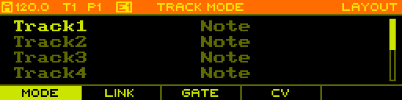

The current clock mode and tempo are shown in the top-left corner. The clock mode can by any of the following:

- `A` Auto
- `M` Master
- `S` Slave

Instead of showing the clock mode, `R` is displayed when recording is enabled.

The currently selected track is shown as `T1` - `T8`. The currently playing pattern on the selected track is shown as `P1` - `P16`. If a song is currently playing, the playing pattern is highlighted. The currently edited pattern is shown as `E1` - `E16` and is highlighted if it matches the pattern that is currently playing. If a snapshot is currently active, the pattern info is replaced with a single item `SNAP`.

The currently active page is shown in the top-right corner and optionally a sub-page or mode is shown to its left.

<h4>Body</h4>

The _body_ is used to display the main content for the active page.

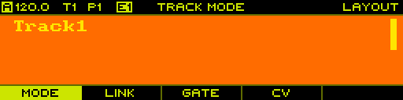

<h4>Footer</h4>

The _footer_ is used to display the labels of the function buttons for the current page.

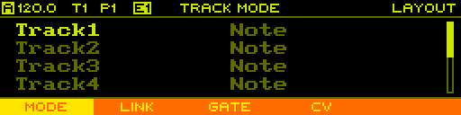

On pages such as the [Layout](#pages-layout) page, the function buttons are used to switch between different sub-pages. In that case, the currently active sub-page is highlighted in the footer.

On pages that provide a context menu, the labels dynamically change to the context menu actions when `SHIFT` + `PAGE` is hold.

<!-- List Pages -->

<h3 id="ui-list-pages">List Pages</h3>

Pages that expose configuration options are typically presented as a list of items, each having the name shown on the left and the value on the right side.

Rotate the `ENCODER` or use `PREV`, `NEXT` to navigate up and down the list. Press `ENCODER` to enter and leave edit mode which is indicated by moving the highlight from the item name to the item value and back. While in edit mode, rotate the `ENCODER` or use `PREV`, `NEXT` to adjust the value. Hold `SHIFT` to change the value in larger or smaller steps depending on item being edited.

<!-- Copy/Paste -->

<h3 id="ui-copy-paste">Copy/Paste</h3>

To allow moving and copying data, a copy/paste system is implemented that allows acting on the following types of objects:

- Track (see [Track](#pages-track) page)
- Sequence (see [Sequence](#pages-sequence) page)
- Steps (see [Steps](#pages-steps) page)
- Pattern (see [Pattern](#pages-pattern) page)
- User Scale (see [User Scale](#pages-user-scale) page)

Copy/paste actions are provided in the context menu when holding `SHIFT` + `PAGE`.

> Note: Due to memory limitations, the clipboard can only hold one object at a time and shares memory across all different types. This means that copying an object always results in the previously copied object being cleared from the clipboard.

<!-- Pages -->

<h2 id="pages">Pages</h2>

<!-- Project -->

<h3 id="pages-project">Project</h3>

The _Project_ page is entered using `PAGE` + `PROJECT`.

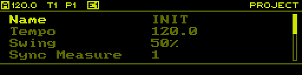

This page allows to change project wide parameters as well loading and saving projects from/to the SD card.

<h4>Parameters</h4>

The following parameters are available:

| Parameter | Range | Description |
| :--- | :--- | :--- |
| Name | - | Press `ENCODER` to enter text editor for changing the project name. |
| Tempo | 1.0 - 1000.0 BPM | Tempo of the master clock. |
| Swing | 50% - 75% | Global swing amount. |
| Sync Measure | 1 - 128 | Multiple of measures/bars at which to execute _syncing_ (see [Pattern](#pages-pattern) and [Performer](#pages-performer) pages) as well as the duration each pattern slot is played for in song mode (see [Song](#pages-song) page). |
| Scale | [Scales](#appendix-scales) | Default scale. Can be overwritten per sequence on the [Sequence](#pages-sequence) page. |
| Root Note | C, C#, D, D#, E, F, F#, G, G#, A, B | Default root note. Can be overwritten per sequence on the [Sequence](#pages-sequence) page. |
| Record Mode | Overdub, Overwrite | Recording mode. |

> Note: _Tempo_ and _Swing_ are routable parameters.

<h4>Context Menu</h4>

Hold `SHIFT` + `PAGE` to open the context menu and access the following functions:

| Button | Function | Description |
| :--- | :--- | :--- |
| `F1` | Init | Initialize the project to its default state. This will revert all unsaved changes. |
| `F2` | Load | Load a project from the SD card. |
| `F3` | Save | Save the project to the SD card and automatically overwrite the previous slot. |
| `F4` | Save As | Save the project to a new slot on the SD card. |
| `F5` | Route | Show existing or create a new route for the currently selected parameter (only active if selected parameter is routable). |

> Note: Should you ever get bored sequencing, take a break and hit `PAGE` + `STEP16`.

<!-- Layout -->

<h3 id="pages-layout">Layout</h3>

The _Layout_ page is entered using `PAGE` + `LAYOUT`. This page has 4 tabs accessed through `F1`, `F2`, `F3` and `F4`.

<h4>Track Mode</h4>

The first tab is used to configure the track mode of each track.

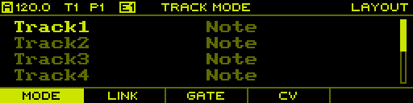

Changing track mode results in all data associated with a given track to be erased. Because of this, when setting a new track mode, it only takes effect after manually committing the change by pressing `F5`.


<h4>Link Track</h4>

The second tab is used to setup track linking. Each of the 8 tracks can be linked to any of the preceding tracks, taking over its playback behavior.

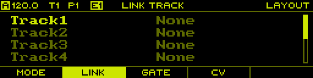

<h4>Gate Output</h4>

The third tab is used to setup the mapping of virtual track gate outputs to the physical gate outputs. In default state, each track is linked to the corresponding gate output with the same number.

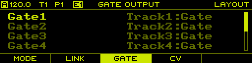

<h4>CV Output</h4>

The fourth tab is used to setup the mapping of virtual track CV outputs to the physical CV outputs. In default state, each track is linked to the corresponding CV output with the same number.

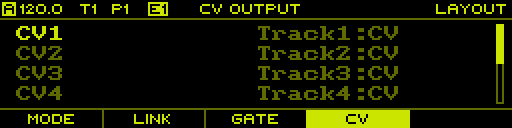

If using a MIDI/CV track, it can be useful to map multiple virtual outputs of the track to physical outputs to allow for polyphonic signals or add modulation signals such as velocity or aftertouch. The following shows a configuration with two note polyphony and pitch/velocity signals.

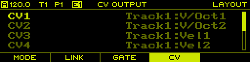

<!-- Track -->

<h3 id="pages-track">Track</h3>

The _Track_ page is entered using `PAGE` + `TRACK`.

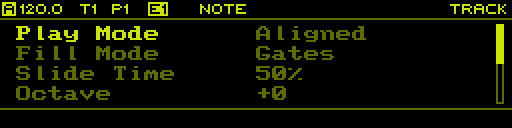

This page allows to change track wide settings. Note that the shown parameters depend on the configured _Track Mode_ of the selected track. Press `TRACK[1-8]` to change the selected track.

<h4>Context Menu</h4>

Hold `SHIFT` + `PAGE` to open the context menu and access the following functions:

| Button | Function | Description |
| :--- | :--- | :--- |
| `F1` | Init | Initialize the selected track and all its content to the default state. |
| `F2` | Copy | Copy the selected track and all its content to the clipboard. |
| `F3` | Paste | Paste the clipboard to the selected track. |
| `F4` | Route | Show existing or create a new route for the currently selected parameter (only active if selected parameter is routable). |

<h4>Note Track</h4>


If a track is in _Note_ mode, the following parameters are available:

| Parameter | Range | Description |
| :--- | :--- | :--- |
| Play Mode | [Play Modes](#appendix-play-modes) | Mode used for playing sequences in this track. |
| Fill Mode | None, Gates, Next Pattern | Mode used when fill is activated for the track. _None_ does nothing. _Gates_ plays each step of the sequence independent of whether the step gate is active or not. _Next Pattern_ uses the step data of the next pattern on the same track. |
| Slide Time | 0% - 100% | Duration of voltage slides for steps that have _Slide_ enabled. |
| Octave | -10 - +10 | Number of octaves to transpose the sequence up or down. |
| Transpose | -100 - +100 | Number of notes to transpose the sequence up or down. Note that this depends on the current [Scale](#appendix-scales) of the sequence.
| Rotate | [Rotation](#appendix-rotation) |Amount of rotation applied to the sequence. |
| Gate Prob Bias | -100% - +100% | Gate probability bias that is added to the sequence. |
| Length Bias | -100% - +100% | Length bias bias that is added to the sequence. |

> Note: _Slide Time_, _Octave_, _Transpose_, _Rotate_, _Gate Prob Bias_ and _Length Bias_ are routable parameters. These parameters are great for live performance, as they allow to change how the sequence is played back without actually changing the sequence itself.

<h4>Curve Track</h4>

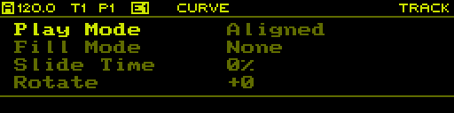

If a track is in _Curve_, the following parameters are available:

| Parameter | Range | Description |
| :--- | :--- | :--- |
| Play Mode | [Play Modes](#appendix-play-modes) | Mode used for playing sequences in this track. |
| Fill Mode | None, Gates, Next Pattern | Mode used when fill is activated for the track. _None_ does nothing. _Gates_ plays each step of the sequence independent of whether the step gate is active or not. _Next Pattern_ uses the step data of the next pattern on the same track. |
| Rotate | [Rotation](#appendix-rotation) | Amount of rotation applied to the sequence. |

> Note: _Rotate_ is a routable parameter.

<h4>MIDI/CV Track</h4>

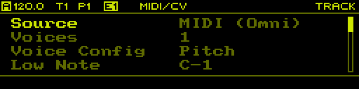

If a track is in MIDI/CV mode, the following parameters are available:

| Parameter | Range | Description |
| :--- | :--- | :--- |
| Source | MIDI, USB | MIDI source port (hold `SHIFT` and rotate `ENCODER` to select MIDI channel). |
| Voices | 1 - 8 | Number of voices. |
| Voice Config | Pitch, Pitch\|Vel, Pitch\|Vel\|Press | CV signals to generate for each voice. |
| Pitch Bend | off, 1 - 48 semitones | Pitch bend range. |
| Mod Range | 1-5V Unipolar, 1-5V Bipolar | CV output voltage range for modulation signals (velocity and pressure). |
| Retrigger | no, yes | Retrigger voices on each received _Note On_ MIDI message. |

<!-- Sequence -->

<h3 id="pages-sequence">Sequence</h3>

The _Sequence_ page is entered using `PAGE` + `SEQ`.

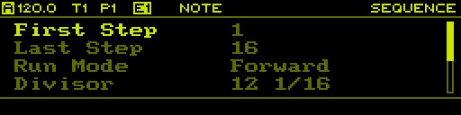

This page allows to change the sequence settings of the currently selected sequence on the selected track. Note that the shown parameters depend on the configured _Track Mode_ of the selected track. Press `TRACK[1-8]` to change the selected track. Hold `PATT` and rotate the `ENCODER` to change the selected sequence.

For quick access to most of the sequence parameters, there is also a quick edit mode on the [Steps](#pages-steps) page, introduced in the next section.

<h4>Context Menu</h4>

Hold `SHIFT` + `PAGE` to open the context menu and access the following functions:

| Button | Function | Description |
| :--- | :--- | :--- |
| `F1` | Init | Initialize the selected sequence and all its content to the default state. |
| `F2` | Copy | Copy the selected sequence and all its content to the clipboard. |
| `F3` | Paste | Paste the clipboard to the selected sequence. |
| `F4` | Duplicate | Copy the selected sequence to the next sequence on the selected track. For example copy of the first sequence to the second sequence. |

<h4>Note Track</h4>


If a track is in _Note_ mode, the following parameters are available:

| Parameter | Range | Description |
| :--- | :--- | :--- |
| Scale | [Scales](#appendix-scales) | Scale to use for this sequence. If set to _Default_, uses the default scale set on the [Project](#pages-project) page. |
| Root Note | C, C#, D, D#, E, F, F#, G, G#, A, B | Root note to use for this sequence. If set to _Default_, uses the default root note set on the [Project](#pages-project) page. |
| Divisor | [Divisors](#appendix-divisors) | Time divisor for this sequence. |
| Reset Measure | off, 1 - 128 | Number of measures/bars at which to reset the sequence. |
| Run Mode | [Run Modes](#appendix-run-modes) | Mode in which to play the sequence.  |
| First Step | 1 - 64 | First step to play. |
| Last Step | 1 - 64 | Last step to play. |

<h4>Curve Track</h4>

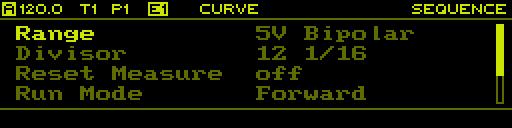

If a track is in _Curve_ mode, the following parameters are available:

| Parameter | Range | Description |
| :--- | :--- | :--- |
| Range | 1V - 5V Unipolar, 1V - 5V Bipolar | Voltage range to use for this sequence. |
| Divisor | [Divisors](#appendix-divisors) | Time divisor for this sequence. |
| Reset Measure | off, 1 - 128 | Number of measures/bars at which to reset the sequence. |
| Run Mode | [Run Modes](#appendix-run-modes) | Mode in which to play the sequence.  |
| First Step | 1 - 64 | First step to play. |
| Last Step | 1 - 64 | Last step to play. |

<!-- Steps -->

<h3 id="pages-steps">Steps</h3>

The _Steps_ page is entered using `PAGE` + `SEQ EDIT`.

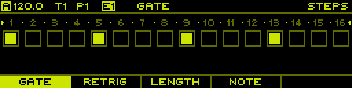
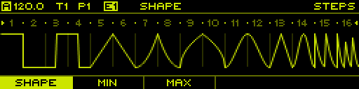

This page allows editing the currently selected sequence on the currently selected track. Depending on the track mode of the selected track, this page shows a different graphical representation of the sequence. If track mode is set to _MIDI/CV_, the page is not available and selecting it will jump to the [Track](#pages-track) page.

<h4>Layer Selection</h4>

Sequence data is organized in layers (see [Note Track](#concepts-note-track) and [Curve Track](#concepts-curve-track)). Press `F1`, `F2`, `F3`, `F4` or `F5` to select different layers. The currently selected layer is shown in the header and the graphical representation of the sequence will change accordingly. Note that each function button can represent a group of layers, in which case pressing the same function button repeatedly will cycle through the layers contained in the group.

The following layers are available in _Note_ mode:

| Button | Layers |
| :--- | :--- |
| `F1` | Gate, Gate Probability, Slide |
| `F2` | Retrigger, Retrigger Probability |
| `F3` | Length, Length Variation Range, Length Variation Probability |
| `F4` | Note, Note Variation Range, Note Variation Probability |

The following layers are available in _Curve_ mode:

| Button | Layers |
| :--- | :--- |
| `F1` | Shape |
| `F2` | Minimum |
| `F3` | Maximum |

<h4>Section Selection</h4>

Sequences contain up to 64 steps, of which only 16 are shown on the page. Press `PREV` and `NEXT` to select one of the 4 available sections (1-16, 17-32, 33-48, 49-64). The currently selected section is indicated by the 4 LEDs in the bottom left corner as well as with the step indices above each step on the page.

<h4>Editing Steps</h4>

To adjust the values of the currently selected layer, hold `STEP[1-16]` and rotate the `ENCODER`. To adjust multiple steps at the same time, hold multiple step buttons and rotate the `ENCODER`. The currently selected steps are visualized both on the page by highlighting the step indices as well as on the step LEDs which turn orange. When adjusting multiple steps, the values are adjusted relative to their current value. Depending on the track mode and the selected layer, there is some additional functionality available:

- When editing the _Gate_ layer on a sequence of a _Note_ track, pressing `STEP[1-16]` enables/disables the gate values.
- When editing any other layer on a sequence of a _Note_ track, holding one or multiple step buttons and pressing the `ENCODER` enables/disables the gate values. This comes in handy for example when editing note values, as gates can easily be enabled/disabled without switching layers.
- When editing layers on a sequence of a _Curve_ track, pressing and rotating the `ENCODER` adjusts the values in smaller steps.

<h4>Advanced Step Selection</h4>

When holding `SHIFT` and pressing any of the step buttons, steps are selected in a _persistent_ mode. This means that steps are kept selected even when the step buttons are released. This allows to select multiple steps across different sections. Steps can also be removed from the selection by holding `SHIFT` and pressing step buttons corresponding to selected steps again. To clear the entire selection, simply press any step button without holding `SHIFT` or quickly press `SHIFT` twice (double tap). When the selection is empty, double tap `SHIFT` to select all 64 steps.

Finally, there is a shortcut to select a series of steps. For example, to select steps 1, 5, 9, 13 and so forth, hold `SHIFT` and `STEP1` and then double tap `STEP5` while holding the other two buttons. With this shortcut, any series of steps with a common interval can be selected quickly, great to build rhythms.

> Note: Different series can be combined by applying the shortcut multiple times. Each time it is executed, the steps of the series are added to the selection.

<h4>Shifting Steps</h4>

Press `SHIFT` + `PREV` or `SHIFT` + `NEXT` to shift all steps in the sequence to the left or right. This has the same effect as [Rotation](#appendix-rotation), but instead of changing the playback position, shifting actually moves the steps in the sequence itself.

<h4>Context Menu</h4>

Hold `SHIFT` + `PAGE` to open the context menu and access the following functions:

| Button | Function | Description |
| :--- | :--- | :--- |
| `F1` | Init | Initialize all steps of the current sequence to the default state. |
| `F2` | Copy | Copy the selected steps to the clipboard. |
| `F3` | Paste | Paste steps in the clipboard to the selected steps. |
| `F4` | Duplicate | Doubles the length of the sequence between _First Step_ and _Last Step_ and copies the first half to the second half. |

Copy/Paste only works with steps selected in _persistent_ mode. When more steps are pasted than copied to the clipboard, the steps will be repeated multiple times. This means that for example one can copy 2 steps and then paste them to 8 steps, creating a repetition of the two copied steps.

<h4>Quick Access</h4>

The _Steps_ page is one of the most frequently used pages when operating the sequencer. To change sequence parameters such as the _Run Mode_, _First Step_, _Last Step_ and others, one needs to temporarily switch to the [Sequence](#pages-sequence) page. This breaks the workflow, especially when in a live situation, where immediate access to the most important features and parameters is paramount. To help improve the workflow, most of the sequence parameters can be accessed through a quick access function. To access a parameter, hold `PAGE` and press `STEP[9-16]`, similarly to switching between pages, but keep holding the `PAGE` button. The page is now overlayed with the selected parameter.

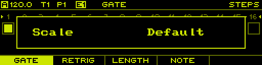

Depending on the _Track Mode_, the following parameters are available through quick access:

| Button | Note Track | Curve Track |
| :--- | :--- | :--- |
| `STEP9` | Scale | Range |
| `STEP10` | Root Note | - |
| `STEP11` | Divisor | Divisor |
| `STEP12` | Reset Measure | Reset Measure |
| `STEP13` | Run Mode | Run Mode |
| `STEP14` | First Step | First Step |
| `STEP15` | Last Step | Last Step |
| `STEP16` | - | - |

While holding the `PAGE` button, the selected sequence parameter can be adjusted by rotating the `ENCODER` or by pressing `STEP[1-16]` to select the most common values. Releasing the `PAGE` button will return to the normal state of the steps page.

> Note: When quick access is active, the step LEDs will indicate the range of values that can be selected in green as well as the current selection in red.

<!-- Song -->

<h3 id="pages-song">Song</h3>

The _Song_ page is entered using `PAGE` + `SONG`.

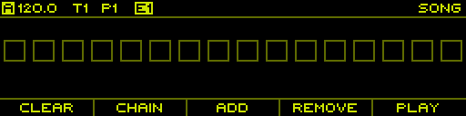

A song consists of up to 16 slots, each referencing a set of 8 patterns to be played on the 8 tracks. Each slot is played for the duration set by _Sync Measure_ on the [Project](#pages-project) page and can be repeated up to 8 times.

<h4>Pattern Chaining</h4>

A quick way to create songs on the fly is pattern chaining. This mode is specifically made for live performance to quickly create more interesting structures by chaining multiple patterns together.

To create a pattern chain, hold `F2` and press `STEP[1-16]` to select the pattern to be played for the newly created slot. If the same pattern is added multiple times by pressing `STEP[1-16]` again, the repeat count of the last added slot is incremented. For example, holding `F2` and pressing the sequence `STEP1`, `STEP1`, `STEP1`, `STEP2`, `STEP1`, `STEP1`, `STEP1`, `STEP3` will create the following slot list:

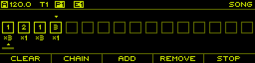

Note that when creating pattern chains, the song mode is automatically started.

<h4>Editing</h4>

- Rotate the `ENCODER` or use `PREV` and `NEXT` to select any of the assigned slots indicated with the small cursor above the slots.
- Press `F1` to clear the slot list.
- Press `F3` to add a slot at the end of the list.
- Press `SHIFT` + `F3` to insert a slot at the current cursor position.
- Press `F4` to remove the selected slot.
- Hold `SHIFT` and rotate the `ENCODER` or use `PREV` and `NEXT` to move the selected slot forward and backward in the slot list.
- Press `STEP[1-16]` to assign a pattern to all tracks of the selected slot.
- Hold any combination of `TRACK[1-8]` and press `STEP[1-16]` to assign a pattern to a group of tracks of the selected slot.
- Press and rotate the `ENCODER` to adjust the number of repeats on the selected slot.

<h4>Playback</h4>

Song playback can be started and stopped independently of the sequencer actually running. This allows to engage song playback while the sequencer is already running, or stop song playback without stopping the sequencer. Song playback simply changes the playing patterns automatically and in sync.

Press `F5` to start playback of the song from the currently selected slot. This will also start the sequencer if it is not already running. Playback will be immediate, meaning that the currently playing pattern is switched instantaneously. To start playback on the next _Sync Measure_, use `SHIFT` + `F5` to start playback. A progress bar will appear at the top of the page, indicating the time until playback is started. To stop playback, simply press `F5` again.

During playback, the current slot being played is indicated by a small cursor below the slot list with a small progress bar indicating the progress through the slot. In addition, the currently playing pattern in the header list is highlighted.

> Note: Song mode can also be used to toggle between different sets of patterns. Simply use slots to define the pattern sets and then select a slot and press `F5` twice to quickly start/stop song playback to switch to a new set of patterns.

<!-- Tempo -->

<h3 id="pages-tempo">Tempo</h3>

The _Tempo_ page is temporarily shown while holding `TEMPO`.

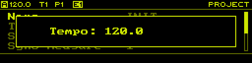

On this page the tempo of the master clock is adjusted. Simply rotate the `ENCODER` to adjust the tempo. Press and rotate the `ENCODER` to adjust the tempo in smaller steps. Hold `SHIFT` and rotate the `ENCODER` to adjust in larger steps.

<h4>Tap Tempo</h4>

In addition to manually adjusting the tempo, it can also be set using tap tempo by pressing `PLAY` in a regular interval while holding `TEMPO`.

<h4>Nudging</h4>

To sync the master clock by ear to some other source, for example a turntable, tempo nudging is a useful feature. This allows the tempo to be temporarily increased/decreased within a 10% range. Nudging is activated by holding `TEMPO` and holding `NEXT` or `PREV` to increase/decrease the tempo. The amount of tempo change due to nudging is visualized on the tempo page.

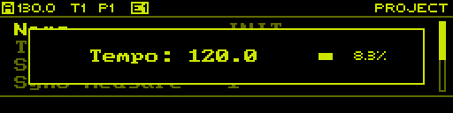

> Note: The tempo is incrementally increased/decreased up to 10%, so one needs to hold both `TEMPO` and `NEXT` or `PREV` for a small amount of time to get an effect.

<!-- Pattern -->

<h3 id="pages-pattern">Pattern</h3>

The _Pattern_ page can either be permanently entered using `PAGE` + `PATT` or just temporarily while holding `PATT`.


On this page you can handle pattern changes as well as selecting the currently edited pattern. Pattern changes can be scheduled by using _latching_ or _syncing_. In addition, this page gives access to the snapshot system and allows for copy/pasting patterns.

<h4>Editing Pattern</h4>

To change the pattern for editing which is indicated in the header as `E[1-16]` simple rotate the `ENCODER` or press `PREV` and `NEXT`. Alternatively you can use `SHIFT` + `STEP[1-16]` to select the editing pattern.

> Note: The editing pattern indicated in the header is highlighted if the selected pattern for editing is the same as the currently playing pattern.

<h4>Pattern Changes</h4>

To change to any of the 16 patterns press `STEP[1-16]`. This will switch all tracks to play the selected pattern immediately. To only switch patterns for certain tracks, hold any combination of `TRACK[1-8]` and then select the pattern using `STEP[1-16]`.

<h4>Latching Pattern Changes</h4>

To perform multiple pattern changes at the same time, hold `F1` while performing pattern changes. All changes are scheduled and executed together when `F1` is let go. While `F1` is hold and some changes have been scheduled, you can press `F5` to cancel them.

> Note: When using the temporary mode of the performer page by holding `PATT`, you can let go of `PATT` while holding `F1` and keep the page open.

<h4>Synced Pattern Changes</h4>

To execute pattern changes on a musical beat, hold `F2` while performing pattern changes. A progress bar will appear at the top of the page, indicating the time until the changes are executed. Again, while holding `F2` you can press `F5` to cancel any scheduled changes.

> Note: When using the temporary mode of the performer page by holding `PATT`, you can let go of `PATT` while holding `F2` and keep the page open.

> Note: Synced actions are triggered on the beginning of a musical measure, configured on the [Project](#pages-project) page using the _Sync Measure_ parameter.

<h4>Snapshots</h4>

Snapshots are a useful tool to quickly make a temporary copy of all patterns currently playing and later take over the changes or throw them away.

Press `F3` create a snapshot of the patterns currently being played.

Note that the pattern indicators at the top-left of the screen change to `SNAP`, indicating that snapshot mode is active. While in snapshot mode, all functions of the sequencer remain working as expected, with the only exception that patterns cannot be changed on the [Pattern](#pages-pattern) page.

After editing the snapshot, press `F4` to commit the changes back to the original patterns. To commit the changes to a new set of patterns, press `STEP[1-16]` + `F4`. This will automatically change all tracks to play the selected pattern after the snapshot is committed.

Press `F3` to revert the edits done on the snapshot and go back to playing the set of patterns that have been playing before taking the snapshot. Press `STEP[1-16]` + `F3` to revert the snapshot but continue playing a new set of patterns.

<h4>Actions</h4>

<!-- Performer -->

<h3 id="pages-performer">Performer</h3>

The _Performer_ page can either be permanently entered using `PAGE` + `PERF` or just temporarily while holding `PERF`.

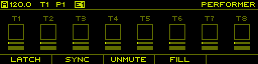

On this page you can handle mutes/solos as well as fills. Similar as with pattern changes you can also schedule mute, unmute or solo actions either by using _latching_ or _syncing_.

The temporary mode is very handy to quickly trigger performance actions while working on another page.

<h4>Mutes/Solos</h4>

Press `TRACK[1-8]` to mute and unmute tracks or `STEP[1-8]` to solo a track. Press `F3` to unmute all tracks at once.

<h4>Latching Mutes/Solos</h4>

To perform multiple actions at the same time, hold `F1` while executing mute, unmute or solo actions. All actions are scheduled and executed together when `F1` is let go. While `F1` is hold and some actions have been scheduled, you can press `F5` to cancel them.

> Note: When using the temporary mode of the performer page by holding `PERF`, you can let go of `PERF` while holding `F1` and keep the page open.

<h4>Synced Mutes/Solos</h4>

To execute actions on a musical beat, hold `F2` while executing mute, unmute or solo actions. A progress bar will appear at the top of the page, indicating the time until the actions are executed. Again, while holding `F2` you can press `F5` to cancel any scheduled action.

> Note: When using the temporary mode of the performer page by holding `PERF`, you can let go of `PERF` while holding `F2` and keep the page open.

> Note: Synced actions are triggered on the beginning of a musical measure, configured on the [Project](#pages-project) page using the _Sync Measure_ parameter.

<h4>Fills</h4>

Hold `STEP[9-16]` to enable fills on individual tracks. Hold `F4` to fill all tracks at once.

> Note: There are different fill modes that can be configured per track on the [Track](#pages-track) page using the _Fill Mode_ parameter.

<!-- Routing -->

<h3 id="pages-routing">Routing</h3>

The _Routing_ page is entered using `PAGE` + `ROUTING`.

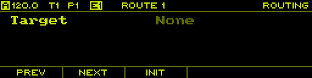

There is a maximum of 16 routes that can be set up. Press `F1` and `F2` or hold `SHIFT` and rotate the `ENCODER` to select the route to edit.

To create a new route, select one of the empty routes that has _Target_ value set to _None_. Then press the encoder to select a routing target by rotating the `ENCODER`.

> Note: Most routable parameters can alternatively be set up from the page where the parameter is exposed ([Project](#pages-project) and [Track](#pages-track) pages) by using the context menu and selecting _Route_. This automatically switches to the _Routing_ page and sets up the next available route for the chosen parameter, or selects the previously created route.

Once the routing target is selected, the following parameters are available for configuration:

| Parameter | Range | Description |
| :--- | :--- | :--- |
| Target | Routable Parameters | Target parameter to affect by this route. |
| Min | - | Value to set the target parameter to when source is at the minimum value. |
| Max | - | Value to set the target parameter to when source is at the maximum value. |
| Tracks | - | Target tracks to affect by this route. Only available if selected target parameter is a track parameter. Press `ENCODER` to edit the value and press `TRACK[1-8]` to select which tracks are affected. |
| Source | None, CV In 1-4, CV Out 1-8, MIDI | Source signal to use. _CV In 1-4_ correspond to the physical CV inputs. _CV Out 1-8_ correspond to the CV output signals generated by the sequencer. _MIDI_ uses events from either MIDI or USB. |
| Range | 1V - 5V Unipolar, 1V - 5V Bipolar | Voltage range to use for the CV source. Only available if source is set to a _CV In 1-4_ or _CV Out 1-8_. |
| MIDI Source | MIDI, USB | MIDI port (hold `SHIFT` and rotate `ENCODER` to select MIDI channel) used for the source. Only available when source is set to _MIDI_. |
| MIDI Event | CC Absolute, CC Relative, Pitch Bend, Note Momentary, Note Toggle, Note Velocity | MIDI event to use as the source signal. Only available when source is set to _MIDI_. |
| CC Number | 0 - 127 | MIDI CC number to use as the source signal. Only available if MIDI Event is set to _CC Absolute_ or _CC Relative_. |
| Note | C-1 - G9 | MIDI note number to use as the source signal. Only available if MIDI Event is set to _Note Momentary_, _Note Toggle_ or _Note Velocity_. |

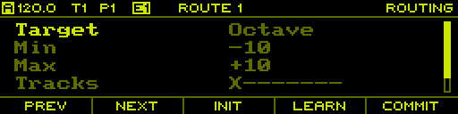

When changing the route parameters, they will not immediately be active. Press `F5` to commit the changes and make the new configuration active. An existing route can be reset to its default state by pressing `F3`. Again, the change has no effect before being committed using `F5`.

In order to simplify assigning MIDI controllers to target parameters, press `F4` to enter MIDI learn mode. Simply rotate an encoder or press a key/button on the connected MIDI controller to assign it to the target parameter. MIDI learn mode is active when the _Learn_ button is highlighted. Press `F4` again to exit MIDI learn mode without assigning a MIDI controller.

> Note: When creating a route, the original value the target parameter was set to before creating the route is lost. This also implies that the target parameter will not go back to its original value when a route is deleted.

<!-- Midi Output -->

<h3 id="pages-midi-output">Midi Output</h3>

The _Midi Output_ page is entered using `PAGE` + `MIDI OUT`.

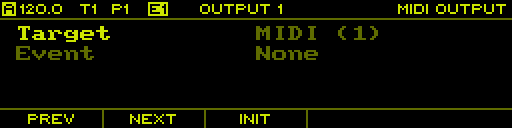

TODO

<!-- User Scale -->

<h3 id="pages-user-scale">User Scale</h3>

The _User Scale_ page is entered using `PAGE` + `USER SCALE`.


On this page you can edit the 4 user scales stored in the project. Switch between the 4 scales using `F1`, `F2`, `F3` and `F4`.

As with the preset scales, user scales can either be in _Chromatic_ or _Voltage_ mode. The former is used to create scales from the 12 semitones of the equal tempered chromatic scale. The latter can be used to make arbitrary scales.

The number of items in the scale is set with the _Size_ parameter and can be up to 32 items.

When in _Chromatic_ mode, each item can be assigned a semitone: **1**, **1#**, **2**, **2#**, **3**, **4**, **4#**, **5**, **5#**, **6**, **6#** or **7**.

When in _Voltage_ mode, each item can be assigned a voltage between -5V and +5V with millivolts accuracy.

> Note: The items defined in the user scale represent a single octave of the scale, which is equal to 12 semitones (1V) in _Chromatic_ mode and the interval between the first and last item in _Voltage_ mode. The other octaves are automatically inferred by repetition.

<h4>Context Menu</h4>

Hold `SHIFT` + `PAGE` to open the context menu and access the following functions:

| Button | Function | Description |
| :--- | :--- | :--- |
| `F1` | Init | Initialize the selected user scale to the default state. |
| `F2` | Copy | Copy the selected user scale to the clipboard. |
| `F3` | Paste | Paste the clipboard to the selected user scale. |
| `F4` | Load | Load a user scale from the SD card into the selected user scale. |
| `F5` | Save | Save the selected user scale to the SD card. |

<!-- Monitor -->

<h3 id="pages-monitor">Monitor</h3>

The _Monitor_ page is entered using `PAGE` + `MONITOR`. This page has 4 tabs accessed using `F1`, `F2`, `F3` and `F4`.

<h4>CV Inputs</h4>

The first tab shows the current voltages of the CV inputs.

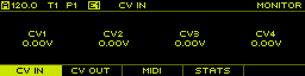

<h4>CV Outputs</h4>

The second tab shows the current voltages of the CV outputs.

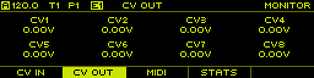

<h4>MIDI</h4>

The third tab shows incoming MIDI messages.

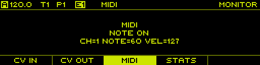

<h4>Stats</h4>

The fourth tab shows general stats of the sequencer such as the total uptime and overflows of the MIDI message queues.

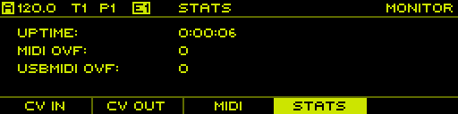

<!-- Clock -->

<h3 id="pages-clock">Clock</h3>

The _Clock_ page is entered using `PAGE` + `CLOCK`.

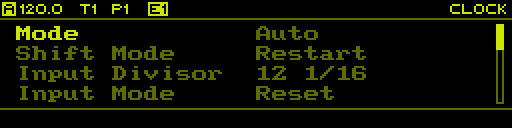

This page is used to setup the clock system of the sequencer using the following parameters:

| Parameter | Range | Description |
| :--- | :--- | :--- |
| Mode | Auto, Master, Slave | Clock mode |
| Shift Mode | Restart, Pause | Action to perform when `SHIFT` + `PLAY` is pressed: In _Restart_ mode, the master clock is restarted. In _Pause_ mode, the master clock is stopped/resumed. |
| Input Divisor | [Divisors](#appendix-divisors) | Musical note duration at which to interpret incoming clock pulses. The divisor is actually used as a clock multiplier to generate the internal 192 PPQN clock resolution. |
| Input Mode | Reset, Run, Start/Stop | Mode in which to handle the incoming clock control signal. In _Reset_ mode, the clock is kept in reset state while a high signal is read. In _Run_ mode, the clock is only run when the signal is high. In _Start/Stop_ mode, the clock is started when a high signal is read and stopped/paused when a low signal is read. |
| Output Divisor | [Divisors](#appendix-divisors) | Musical note duration at which to generate outgoing clock pulses. The divisor is used to divide the internal 192 PPQN clock resolution to generate the outgoing clock pulses. |
| Output Pulse | 1 - 5 ms | Duration of the outgoing clock pulses. |
| Output Mode | Reset, Run | Mode for generating the outgoing clock control signal. In _Reset_ mode, the signal is high when the clock is stopped and in reset state. In _Run_ mode, the signal is high when the clock is currently running. |
| MIDI RX | yes, no | Receive MIDI clock from MIDI. |
| MIDI TX | yes, no | Transmit MIDI clock to MIDI. |
| USB RX | yes, no | Receive MIDI clock from USB. |
| USB TX | yes, no | Transmit MIDI clock to USB. |

TODO

<!-- System -->

<h3 id="pages-system">System</h3>

The _System_ page is entered using `PAGE` + `SYSTEM` and needs confirmation to prevent accidental entering.


<h4>Calibration</h4>

Press `F1` to show the calibration tab.

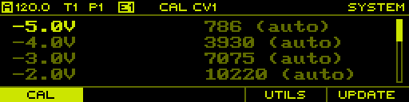

On this tab you can calibrate the 8 physical CV outputs of the sequencer to millivolts accuracy, given that you have access to a volt meter with high accuracy. Proper calibration is important to get accurate pitch signals (1V/Oct) to control the pitch of oscillators.

Each channel is calibrated using a list of calibration entries for all voltages from -5V to +5V at 1V increments. Each entry stores the decimal value that is sent to the digital-to-analog converter for the given voltage. By default, entries are set to _auto_ which automatically determines the best guess for the calibration value. This value is either determined by a reference table or by interpolating other manually set calibration entries.

Press `TRACK[1-8]` to select the channel for calibration. The voltage present at the CV outputs directly depends on the entry selected in the list. This allows to scroll through the list and adjust the calibration values until the CV output generates the correct voltage. To edit a calibration entry, simply press the `ENCODER`. Rotate the encoder to set the calibration value or press `F1` to revert back to the _auto_ value.

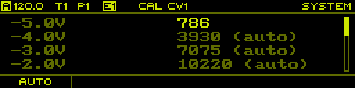

See [Calibration Procedure](#appendix-calibration-procedure) for more information on how to efficiently calibrate the CV outputs.

<h4>Context Menu</h4>

Hold `SHIFT` + `PAGE` to open the context menu and access the following functions:

| Button | Function | Description |
| :--- | :--- | :--- |
| `F1` | Init | Initialize the settings to the default state. |
| `F2` | Save | Save the settings to flash memory. |
| `F3` | Backup | Backup the settings to the SD card. |
| `F4` | Restore | Restore the settings from the SD card. |

<h4>Utilities</h4>

Press `F4` to show the utilities tab.

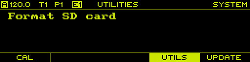

Currently there is only one utility to allow formatting the SD card.

<h4>Update</h4>

Press `F5` to show the update tab.

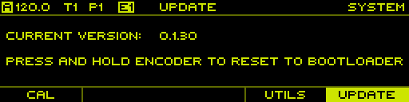

This tab shows the current version of the firmware and allows to reset to the bootloader to easily initiate the firmware update procedure. See [Firmware Update](#appendix-firmware-update) for more information.

<!-- Appendix -->

<h2 id="appendix">Appendix</h2>

<!-- Divisors -->

<h3 id="appendix-divisors">Divisors</h3>

Divisors are used to divide the clock ticks with a resolution of 192 PPQN into periods corresponding to musical notes. While any integer number between 1 and 192 can be used as a divisor, the following known divisor values are used to generate the commonly used musical notes:

| Divisor | Note | Name |
| :--- | :--- | :--- |
| 2   | 1/64T | Triplet sixty-fourth note   |
| 3   | 1/64  | Sixty-fourth note           |
| 4   | 1/32T | Triplet thirty-second note  |
| 6   | 1/32  | Thirty-second note          |
| 8   | 1/16T | Triplet sixteenth note      |
| 9   | 1/32. | Dotted thirty-second note   |
| 12  | 1/16  | Sixteenth note              |
| 16  | 1/8T  | Triplet eighth note         |
| 18  | 1/16. | Dotted sixteenth note       |
| 24  | 1/8   | Eighth note                 |
| 32  | 1/4T  | Triplet quarter note        |
| 36  | 1/8.  | Dotted eighth note          |
| 48  | 1/4   | Quarter note                |
| 64  | 1/2T  | Triplet half note           |
| 72  | 1/4.  | Dotted quarter note         |
| 96  | 1/2   | Half note                   |
| 128 | 1T    | Triplet whole note          |
| 144 | 1/2.  | Dotted half note            |
| 192 | 1     | Whole note                  |

<!-- Run Modes -->

<h3 id="appendix-run-modes">Run Modes</h3>

Step sequences can be run in various run modes, which describe the order in which the steps of the sequence are played. To illustrate the different run modes, assume a sequence with **N = 8** steps, indexed from **1** to **8**:

```
1 2 3 4 5 6 7 8
```

<h4>Forward</h4>

In _Forward_ mode, the sequence is played from the first to the last step and then repeated. Each iteration is exactly **N** steps:

```
1 2 3 4 5 6 7 8 | 1 2 3 4 5 6 7 8 | 1 ...
```

<h4>Backward</h4>

In _Backward_ mode, the sequence is played from the last to the first step and then repeated. Each iteration is exactly **N** steps:

```
8 7 6 5 4 3 2 1 | 8 7 6 5 4 3 2 1 | 8 ...
```

<h4>Pendulum</h4>

In _Pendulum_ mode, the sequence is alternately played in forward and backward mode. Each iteration is exactly **2 * N** steps:

```
1 2 3 4 5 6 7 8 8 7 6 5 4 3 2 1 | 1 ...
```

<h4>Ping Pong</h4>

In _Ping Pong_ mode, the sequence is played similarly to the pendulum mode, but when changing direction, the first/last step is not played twice. This essentially shortens the iteration by two steps to **2 * N - 2** steps:

```
1 2 3 4 5 6 7 8 7 6 5 4 3 2 | 1 ...
```

<h4>Random</h4>

In _Random_ mode, the sequence starts with a random step and each time the sequence advances, a new random step is picked:

```
4 7 5 3 5 7 5 3 5 6 8 6 4 2 4 1 3 6 ...
```

<h4>Random Walk</h4>

In _Random Walk_ mode, the sequence starts with a random step and each time the sequence advances, a random coin toss is used to either pick the step to the left or to the right of the last played step. This also works across the boundary from the first to the last step of the sequence:

```
7 8 7 8 1 2 1 2 3 2 3 4 5 4 3 4 3 2 ...
```

<!-- Play Modes -->

<h3 id="appendix-play-modes">Play Modes</h3>

Step sequences can be played in two different modes. In _Aligned_ mode, the default mode, the current step position is computed in a deterministic way, whereas in _Free_ mode, the current step position is always determined based on the previous step position.

The following example illustrates the difference between the two modes: Let's assume a sequence with a length of 16 steps and the step length set to quarter notes, running in _Forward_ mode. When the sequencer is reset and started, the sequence will be played the same in both _Aligned_ and _Free_ mode, advancing to the next step at each quarter note division. Let's assume that the step length is changed to half notes while the sequencer is running and the step sequence is currently at the 9th step. In _Free_ mode, the sequence will continue from the 9th step, but advancing to the next step at each half note division. This means that the step position is not the same as if the sequencer would have been started with the step length set to half notes. This is exactly what _Aligned_ mode does, it always computes the current position based on the time that has passed since the sequencer was last reset and started. So in this example, the sequence would jump to the 5th or 13th step instead and continue playing from there.

In summary, _Free_ mode behaves more like an analog sequencer, which simply advances to the next step when the current step length has passed. This may lead to sequences being played in weird ways, depending on how parameters like _Divisor_, _First Step_ and _Last Step_ are changed while the sequencer is running. While these side effects may allow for some nice happy accidents, _Aligned_ mode is generally the safer bet for most purposes.

<!-- Rotation -->

<h3 id="appendix-rotation">Rotation</h3>

Rotation enables to play back the sequence at different start points. A typical 8 step sequence in _Forward_ mode is played back as follows:

```
1 2 3 4 5 6 7 8 1 2 3 4 5 6 7 8 ...
```

With a rotation of **+1** the sequence is rotated 1 step to the right and played back as follows:

```
2 3 4 5 6 7 8 1 2 3 4 5 6 7 8 1 ...
```

With a rotation of **-3** the sequence is rotated 3 steps to the left and played back as follows:

```
6 7 8 1 2 3 4 5 6 7 8 1 2 3 4 5 ...
```

<!-- Scales -->

<h3 id="appendix-scales">Scales</h3>

<h4>Chromatic</h4>

| Index | 1 | 2 | 3 | 4 | 5 | 6 | 7 | 8 | 9 | 10 | 11 | 12 |
| :--- | --- | --- | --- | --- | --- | --- | --- | --- | --- | --- | --- | --- |
| Name | 1 | 1# | 2 | 2# | 3 | 4 | 4# | 5 | 5# | 6 | 6# | 7 |
| Volts | 0.000 | 0.083 | 0.167 | 0.250 | 0.333 | 0.417 | 0.500 | 0.583 | 0.667 | 0.750 | 0.833 | 0.917 |

<h4>Major</h4>

| Index | 1 | 2 | 3 | 4 | 5 | 6 | 7 |
| :--- | --- | --- | --- | --- | --- | --- | --- |
| Name | 1 | 2 | 3 | 4 | 5 | 6 | 7 |
| Volts | 0.000 | 0.167 | 0.333 | 0.417 | 0.583 | 0.750 | 0.917 |

<h4>Minor</h4>

| Index | 1 | 2 | 3 | 4 | 5 | 6 | 7 |
| :--- | --- | --- | --- | --- | --- | --- | --- |
| Name | 1 | 2 | 3b | 4 | 5 | 6 | 7 |
| Volts | 0.000 | 0.167 | 0.250 | 0.417 | 0.583 | 0.750 | 0.917 |

<h4>Algerian</h4>

| Index | 1 | 2 | 3 | 4 | 5 | 6 | 7 |
| :--- | --- | --- | --- | --- | --- | --- | --- |
| Name | 1 | 2 | 3b | 4# | 5 | 6b | 7 |
| Volts | 0.000 | 0.167 | 0.250 | 0.500 | 0.583 | 0.667 | 0.917 |

<h4>Major Pent.</h4>

| Index | 1 | 2 | 3 | 4 | 5 |
| :--- | --- | --- | --- | --- | --- |
| Name | 1 | 2 | 3 | 5 | 6 |
| Volts | 0.000 | 0.167 | 0.333 | 0.583 | 0.750 |

<h4>Minor Pent.</h4>

| Index | 1 | 2 | 3 | 4 | 5 |
| :--- | --- | --- | --- | --- | --- |
| Name | 1 | 3b | 4 | 5 | 7b |
| Volts | 0.000 | 0.250 | 0.417 | 0.583 | 0.833 |

<h4>Whole Tone</h4>

| Index | 1 | 2 | 3 | 4 | 5 | 6 |
| :--- | --- | --- | --- | --- | --- | --- |
| Name | 1 | 2 | 3 | 4# | 5# | 6# |
| Volts | 0.000 | 0.167 | 0.333 | 0.500 | 0.667 | 0.833 |

<h4>Augumented</h4>

| Index | 1 | 2 | 3 | 4 | 5 | 6 |
| :--- | --- | --- | --- | --- | --- | --- |
| Name | 1 | 3b | 3 | 5 | 5# | 7 |
| Volts | 0.000 | 0.250 | 0.333 | 0.583 | 0.667 | 0.917 |

<h4>Prometheus</h4>

| Index | 1 | 2 | 3 | 4 | 5 | 6 |
| :--- | --- | --- | --- | --- | --- | --- |
| Name | 1 | 2 | 3 | 4# | 6 | 7b |
| Volts | 0.000 | 0.167 | 0.333 | 0.500 | 0.750 | 0.833 |

<h4>Blues</h4>

| Index | 1 | 2 | 3 | 4 | 5 | 6 |
| :--- | --- | --- | --- | --- | --- | --- |
| Name | 1 | 3b | 4 | 5b | 5 | 7b |
| Volts | 0.000 | 0.250 | 0.417 | 0.500 | 0.583 | 0.833 |

<h4>Tritone</h4>

| Index | 1 | 2 | 3 | 4 | 5 | 6 |
| :--- | --- | --- | --- | --- | --- | --- |
| Name | 1 | 2b | 3 | 5b | 5 | 7b |
| Volts | 0.000 | 0.083 | 0.333 | 0.500 | 0.583 | 0.833 |

<h4>5-tet</h4>

| Index | 1 | 2 | 3 | 4 | 5 |
| :--- | --- | --- | --- | --- | --- |
| Name | 0.0 | 0.2 | 0.4 | 0.6 | 0.8 |
| Volts | 0.000 | 0.200 | 0.400 | 0.600 | 0.800 |

<h4>7-tet</h4>

| Index | 1 | 2 | 3 | 4 | 5 | 6 |
| :--- | --- | --- | --- | --- | --- | --- |
| Name | 0.0 | 0.1 | 0.3 | 0.4 | 0.6 | 0.7 |
| Volts | 0.000 | 0.143 | 0.286 | 0.429 | 0.571 | 0.714 |

<h4>12-tet</h4>

| Index | 1 | 2 | 3 | 4 | 5 | 6 | 7 | 8 | 9 | 10 | 11 | 12 |
| :--- | --- | --- | --- | --- | --- | --- | --- | --- | --- | --- | --- | --- |
| Name | 0.0 | 0.1 | 0.2 | 0.3 | 0.3 | 0.4 | 0.5 | 0.6 | 0.7 | 0.8 | 0.8 | 0.9 |
| Volts | 0.000 | 0.083 | 0.167 | 0.250 | 0.333 | 0.417 | 0.500 | 0.583 | 0.667 | 0.750 | 0.833 | 0.917 |

<h4>24-tet</h4>

| Index | 1 | 2 | 3 | 4 | 5 | 6 | 7 | 8 | 9 | 10 | 11 | 12 | 13 | 14 | 15 | 16 | 17 | 18 | 19 | 20 | 21 | 22 | 23 | 24 |
| :--- | --- | --- | --- | --- | --- | --- | --- | --- | --- | --- | --- | --- | --- | --- | --- | --- | --- | --- | --- | --- | --- | --- | --- | --- |
| Name | 0.0 | 0.0 | 0.1 | 0.1 | 0.2 | 0.2 | 0.3 | 0.3 | 0.3 | 0.4 | 0.4 | 0.5 | 0.5 | 0.5 | 0.6 | 0.6 | 0.7 | 0.7 | 0.8 | 0.8 | 0.8 | 0.9 | 0.9 | 1.0 |
| Volts | 0.000 | 0.042 | 0.083 | 0.125 | 0.167 | 0.208 | 0.250 | 0.292 | 0.333 | 0.375 | 0.417 | 0.458 | 0.500 | 0.542 | 0.583 | 0.625 | 0.667 | 0.708 | 0.750 | 0.792 | 0.833 | 0.875 | 0.917 | 0.958 |

<h4>1V</h4>

| Index | 1 | 2 | 3 | 4 | 5 | 6 | 7 | 8 | 9 | 10 |
| :--- | --- | --- | --- | --- | --- | --- | --- | --- | --- | --- |
| Name | 0.0 | 0.1 | 0.2 | 0.3 | 0.4 | 0.5 | 0.6 | 0.7 | 0.8 | 0.9 |
| Volts | 0.000 | 0.100 | 0.200 | 0.300 | 0.400 | 0.500 | 0.600 | 0.700 | 0.800 | 0.900 |

<!-- Shapes -->

<h3 id="appendix-shapes">Shapes</h3>

| Index | 1 | 2 | 3 | 4 | 5 | 6 | 7 | 8 | 9 | 10 | 11 | 12 | 13 | 14 | 15 | 16 | 17 |
| :--- | :---: | :---: | :---: | :---: | :---: | :---: | :---: | :---: | :---: | :---: | :---: | :---: | :---: | :---: | :---: | :---: | :---: |
| Shapes |  |  |  |  |  |  |  |  |  |  |  |  |  |  |  |  |  |

<!-- Launchpad -->

<h3 id="appendix-launchpad">Launchpad</h3>

TODO

<h3 id="appendix-calibration-procedure">Calibration Procedure</h3>

The following method allows you to quickly calibrate the 8 CV outputs of the sequencer to millivolts accuracy. In order to achieve good results you have to use a volt meter capable of measuring within millivolts accuracy.

**The calibration will only be as good as the volt meter to measure the voltages!**

Enter the [System](#pages-system) page using `PAGE` + `SYSTEM`.

For each of the 8 channels, perform the following steps:

- Select the channel by pressing `TRACK[1-8]`.
- Connect the volt meter to the given CV output.
- Select the -5.0V entry and adjust the calibration value such that the volt meter measures as close to -5.000V as possible.
- Repeat the the previous step for the +5.0V entry then for the +0.0V entry.
- At this point, calibration should be good enough with all other entries set to _auto_.
- Check each entry in-between the calibrated ones and adjust them if the measured voltage deviates too much from the expected value. In general it is a good idea to do this recursively by always selecting the voltage in the middle of two calibrated entries. For example, with +0.0V and +5.0V calibrated, continue with either +2.0V or +3.0V.

With all channels calibrated you should save the data to flash memory by holding `SHIFT` + `PAGE` and pressing `F2`. You can also save the calibration data as a backup to the SD card by holding `SHIFT` + `PAGE` and pressing `F3`.

<h3 id="appendix-firmware-update">Firmware Update</h3>

Use the following steps to upgrade the sequencer:

- Download the latest **UPDATE.DAT** file from [https://github.com/westlicht/performer/releases](https://github.com/westlicht/performer/releases).
- Copy the **UPDATE.DAT** file to the root directory of the SD card.
- Insert the SD card into the sequencer's SD card slot.

The update procedure is performed by the bootloader on the sequencer. There are two possible ways to enter the bootloader:

1. Power up the sequencer while pressing down the `ENCODER`.
2. Enter the [System](#pages-system) page and go to the update tab, then press and hold the `ENCODER` which will initiate a reset and jump to the bootloader.

The bootloader will verify the integrity of the **UPDATE.DAT** file using an MD5 hash. Once verified, a confirmation is requested to actually initiate the update process. Simply rotate the `ENCODER` to change to **YES** and press the `ENCODER` to start the update.

After the firmware is written to the flash memory, it is verified again to ensure it was written properly. In case the verification fails, the firmware is erased from flash memory. At this point the sequencer will always enter the bootloader when powering up, allowing to load a different firmware.
